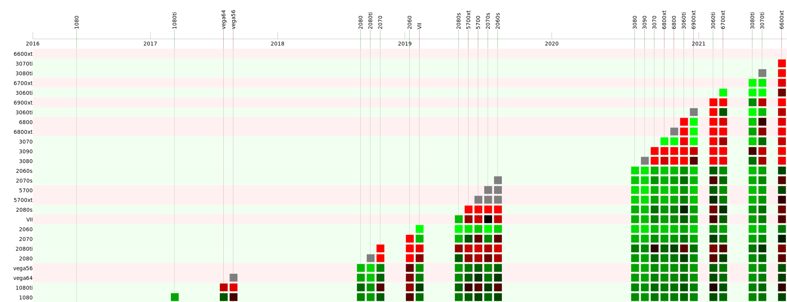
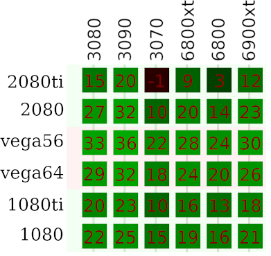

# Motivation

Evaluating GPU performance improvements over time is difficult.
Changes in naming convention market segmentation, new and different target customers, price fluctuations, inflation, new rendering techniques, and expanded feature sets and use cases make direct comparisons between generations and vendors difficult.
Numerous comparisons in various different ways has been made by tech-focused blogs, hardware reviewers, YouTube personalities, and printed publications over the years.
This is text is meant to add to that pool of knowledge.
The intention is not to replace or even improve on all the other sources, only to complement them.

The main question for this text is, how fast are GPUs getting faster?

# Problem statement

The famous Moore's law state that the number of transistors that cost-effectively can be put in a chip doubles every year, later revised to every eighteen months.
Some take this to mean that the performance also doubles within the same amount of time.
While that's debatable, there is no question that the real-world performance of microchips has seen a tremendous development over the decades since their introduction in the early '60s.
Exponential, in fact.
The purpose of this text is to explore that exponential growth within the context of Graphics Processing Units, or GPUs for short.

In a nutshell, what has the recent growth rate for GPU performance been?

# Method

This analysis assumes a steady exponential performance growth rate according to the [standard exponential function](https://en.wikipedia.org/wiki/Exponential_growth#Basic_formula):

where
- `f(t)` is the value of the function at time `t`.
- `f(0)` is the initial value of the function.
- `e` is Euler's number, 2.71828....
- `k` is the growth rate.
- `t` is amount of time during which the exponential growth is occurring.

Unfortunately for us, the GPU market is not on a smooth performance curve with steady exponential growth, there is no well-defined `f(0)` here, and it's unclear what `t` should mean.
Instead we will take a pair-wise approach where the performance growth rate between two GPU with separate release dates is computed.
We use the following variant of the exponential function:

where
- `p_new` is the performance of the newer of the two GPUs.
- `p_old` is the performance of the older of the two GPUs.
- `e` is still Euler's number.
- `k` is still the growth rate.
- `t` is the number of years between the two GPUs' release dates.

Of these the only thing that's unknown is `k`, which is exactly the growth rate that we've been discussing all along.
Let's solve for `k` so we can compute it from the data we already have.

-  `p_new = p_old*e^(k*t)`  Divide by `p_old`.
-  `p_new/p_old = e^(k*t)`  Take the natural logarithm, `loge`, of both sides.
-  `loge(p_new/p_old) = ln(e^(k*t)`  By definition, `loge(e^x) = x`.
-  `loge(p_new/p_old) = k*t`  Swap sides.
-  `k*t = loge(p_new/p_old)`  Divide by `t`.
-  `k = loge(p_new/p_old) / t`  Done!

This means that if we take any pair of GPUs released at different times and plug the performance of the older GPU into `p_old`, the performance of the newer GPU into `p_new`, and the number of years between their respective release dates into `t` then the above formula will give us the annual performance growth rate.

Notice that this is not the same as an annual interest rate of `k`% on a bank account since interest is compounded periodically while growth rate is continuous.
The [Wikipedia article](https://en.wikipedia.org/wiki/E_%28mathematical_constant%29#Compound_interest) is a good read.

Since we deal with continuous, as opposed to periodic, growth the time `t` does not need to be an integer value.
If the newer GPU was released 6 months after the older then `t = 6 / 12 = 0.5`.
In the numbers presented below all dates are truncated to months.

Using the formula for the growth rate `k` we can compute the growth rate that corresponds to the alternative interpretation of Moore's law that states that performance doubles every 18 months. Just set `p_new` twice that of `p_old` and `t` to 18 / 12.

- `p_old = 1` Any non-zero positive value would work.
- `p_new = 2` Twice `p_old`, since we're looking for a doubling.
- `t = 18 / 12` 18 month until doubled and 12 months per year.
- `k = loge(p_new/p_old) / t` Evaluates to 0.4621, or 46.21%.
- `p_new = p_old*e^(k*t)` Sanity check, evaluates to 2. Always check your solutions.

So a doubling after 18 months require a growth rate of 46%.

For comparison purposes, we can also compute how much time a particular growth rate `k` would need to reach double performance:

- `k = loge(p_new/p_old) / t` Multiply by `t`.
- `t*k = loge(p_new/p_old)` Divide by `k`.
- `t = loge(p_new/p_old) / k` Done!

Next we need a definition for "performance", one that is applicable over the entire range of GPUs we are comparing.
I don't have access to all of this hardware myself so I'm relying on performance numbers from independent reviewers, in this case [sweclockers.com](https://www.sweclockers.com/artikel/18402-sweclockers-prestandaindex-for-grafikkort) ([Google translated version](https://translate.google.com/translate?hl=en&sl=sv&tl=en&u=https%3A%2F%2Fwww.sweclockers.com%2Fartikel%2F18402-sweclockers-prestandaindex-for-grafikkort)) using numbers from the 3840x2160 tests.
A GPU's performance can't accurately be characterized by a single number, but let's work with what we have.
Using another source for the performance numbers should be straightforward.

Using the performance numbers from the hardware reviewer we create the Cartesian product of the GPU list and feed each pair into the growth rate computation formula.

# Presentation

With a formula to compute the growth rate between two GPUs and a data set of GPUs to feed into the computation the next step is a way to present the results.

[gpus.svg](./gpus.svg) (best viewed in raw mode) is an image containing a grid of colored boxes.
The X axis, walking along columns in the grid, is a time line and each GPU in the data set is placed on that timeline.
The Y axis, walking down the rows of the grid, is a simple listing of the same GPUs in the same order.
The cells of the grid corresponds to a pair of GPUs, where the GPU on that row is the older GPU and the GPU on that column is the newer GPU.
Notice that the grid is roughly lower-triangular.
This is because we only compute growth rates for old-to-new GPU pairs, not for new-to-old, and the upper-left corner of the grid represents new-to-old pairs.
The columns on the right side of the grid contains many filled cells because those columns belong to the newest GPUs, and the newest GPUs has the highest number of older GPUs to compare against.

The filled cells are color coded based on the growth rate.
Green means that the newer GPU in the pair is faster than the old one, and red means that the newer GPU is slower.
A brighter color means a larger, in absolute value, growth rate so near black means almost no change in performance between the two GPUs.
Gray boxes indicate that the two GPUs was released on the same month, which is a singularity in the growth rate computation since the dates are at the month resolution.
Hovering the cursor over a filled cell reveal the names of the two GPUs, their respective performance numbers, the change in performance, the number of years between the two GPUs' release dates, and the computed growth rate.

The background color of the grid show whether the row belongs to an AMD GPU (red) or a Nvidia GPU (green).
Vertical lines does the same for the columns.

# Results

I encourage you to open the full-size version of the grid and follow along with the discussion below.
The grid cell pop-ups are useful to have.

A few observations.

GPUs are released in clusters, as seen by the separate towers in the grid, where several GPUs are released within a short time span.
This is expected for a series of GPUs, such as the 20 Super series from Nvidia released in mid 2019, but we can see that the 20 Supers was released close to AMD's 5000 series; and Nvidia's 30 series was released close to AMD's 6000 series in 2020.
At the top of these towers is where we find most of the gray cells, meaning that two GPUs were released on the same month.

The brightest colored cells are also for GPU pairs that released close to each other.
This is because in these cases product segmentation dominate over growth-over-time effects.
By that I mean that the slower GPU wasn't slower because it's lower on the technology ladder, but because the manufacturer deliberately placed it on a lower performance tier for cost, power usage, or size reasons.
Also, the very short time between the releases means that the division by the small value `t` in the growth rate formula produces a very large resulting growth rate.

In general, because of these two reasons, the grid cells at the top of the grid cell towers should probably be ignored.

The most interesting part, to me at least, is the lower-right corner of the grid.
This is where the most recent GPUs are compared against the oldest in the data set.
This is where we see the biggest effect of hardware development progress, where a very large difference in performance is spread over a large amount of time, so the computed growth rate should be a good indicator of the true average growth rate.

The colors themselves doesn't say all that much since it's mostly just green, except for the RTX 2080 Ti row where we see that the old GPU holds up well against the newer RTX 3070 and RX 6800.
Let's zoom in a bit and add the growth rate number.

[alternative colors](./images/lower_left_nums_light.png)

If you bought a GTX 1080 on release and then upgraded to a RTX 3070 when it released 4.4 years later then you saw a 15% per year growth rate.
For comparison, remember that the alternative definition of Moore's law with a doubling of performance every 18 months corresponds to a growth rate of 46% per year.

From the numbered cells we see that no upgrade reached that level of performance growth.
Closest is the Vega 56 → RTX 3090 upgrade, which gives a growth rate of 36%.
This corresponds to a doubling every 1.9 years, or 23 months.

Some other interesting numbers:

- GTX 1080 Ti > RTX 3090: Top-end to top-end, mind the price difference tho, two generations over: 23% per year.
- RTX s080 Ti > RTX 3090: Top-end to top end again, one generation: 20%.
- RTX 2080 Ti > RTX 3070: -1%. Nvidia said 3070 would give RTX 2080 Ti level performance and at least according to Sweclockers' tests it sure did.

# Summary

The exponential growth function `p_new = p_old*e^(k*t)` can be used to compute the average growth rate `k` for a pair of GPU with different release dates.
We use GPU performance numbers from Sweclockers' Performance Index to compute the growth rate for each pair of GPUs in the data set.
GPUs released close together in time is not suitable to such comparisons so focus was put on comparing the newest GPUs with the oldest in the data set.
The annual growth rate from the 2018-2019 era GPUs to 2020 era GPUs is around 15-30%.

# Future work

- Test against other data sets.
- Sort the GPUs on performance instead of release date.
- Focus on GPU pairs with the same inflation-corrected MSRPs.
